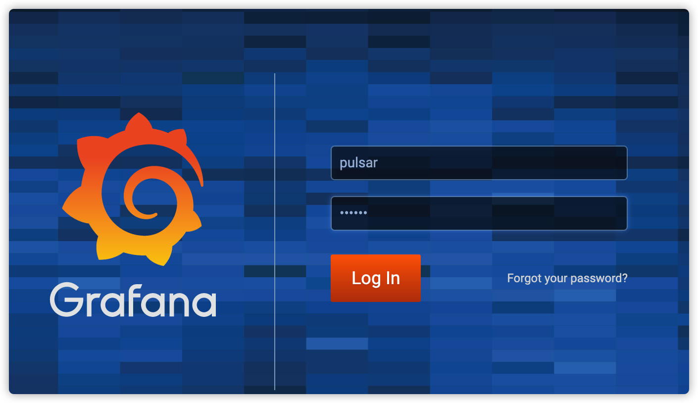
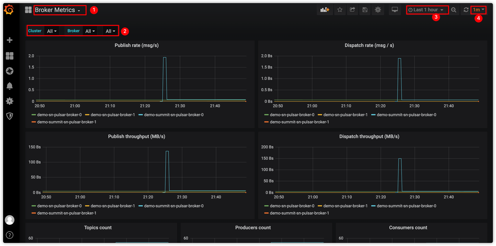

All StreamNative Platform components expose metrics that can be scraped by Prometheus. You can configure Grafana to visualize those metrics in a dashboard.

This document describes how to monitor the StreamNative Platform with the Grafana dashboard.

# Open Grafana in your browser

StreamNative Platform supports [exposing the Grafana service](/operator-guides/configure/monitoring/grafana.md#expose-grafana-service). You can access the Grafana Dashboard through the following URL.

# Use Grafana Dashboard

Grafana provides the following dashboards including brokers, bookies, ZooKeeper, proxy, topic, messages, and so on.

- *Overview*: Displays the overview health of a Pulsar cluster.
- *Messaging Metrics*: Displays the metrics related to Pulsar messaging (such as producers, consumers, message backlog and so on).
- *Proxy Metrics*: Displays the metrics related to Pulsar proxies if you have run proxies in your Pulsar cluster. 
- *Bookie Metrics*: Displays the metrics related to Bookies.
- *ZooKeeper*: Displays the metrics related to ZooKeeper cluster.
- *JVM Metrics*: Displays the JVM related metrics of all the components in a Pulsar cluster (such as proxies, brokers, bookies, and so on).
- *Functions metrics*: Displays the metrics related to Pulsar Functions.
- *Auto Recovery*: Displays the metrics related to auto-recovery.
- *Container*: Displays the metrics related to the container.

*System metrics* are displayed in the *Node Metrics* dashboard and some portions in *Overview* dashboard. 

This figure shows how to monitor the Pulsar broker using the Grafana Dashboards.

| No. | Action |
| --- | --- |
| 1 | Select a Broker Dashboard from the drop-down list. |
| 2 | Select to monitor all brokers or a specific broker. |
| 3 | Configure the time period for collecting the metrics. |
| 4 | Configure the interval for refreshing the dashboard. |