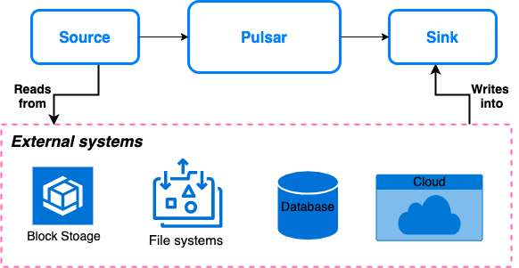

如果消息系统可以方便地和外部系统（如数据库和其他消息系统）一起使用，就能最大程度地发挥消息系统的作用。

**Pulsar IO 连接器** 能让你轻松创建、部署和管理与外部系统互动的连接器，如 [Apache Cassandra](https://cassandra.apache.org) 和 [Aerospike](https://www.aerospike.com)。

**连接器**是一种处理器，它从**流**中输入或输出事件。Pulsar IO 连接器由 **source** 和 **sink** 组成。下图说明了 source、Pulsar 和 sink 之间的关系。

## Source

Source 是指将数据从外部系统传入到 Pulsar 的应用程序。常见的 source 包括其他消息系统和 firehose 式数据管道 API。

关于 source 连接器的完整列表，参见 [source 连接器](https://hub.streamnative.io/)。 

## Sink

Sink 是指将数据从 Pulsar 传出到外部系统的应用程序。常见的 sink 包括其他消息系统，以及 SQL 和 NoSQL 数据库。

关于 sink 连接器的完整列表，参见 [sink 连接器](https://hub.streamnative.io/)。

## 处理保证

处理保证的作用是处理向 Pulsar 主题写入消息时发生的错误。Pulsar 连接器和 Functions 使用相同的处理保证。

| 传递语义                       | 描述 |
| ------------------| ------- |
| 至多一次（`at-most-once`） | 发送到连接器的消息最多被处理一次。因此消息可能不被处理。        |
| 至少一次（`at-least-once`） | 发送到连接器的消息被处理至少一次。因此消息可能被重复处理。 |
| 有效一次（`effectively-once`） | 发送到连接器的消息只被处理一次，并有一个与之关联的输出。 |

连接器的处理保证不仅依赖于 Pulsar 保证，还**与外部系统有关**，即 **source 和 sink 的实现**。对于 source，Pulsar 可以确保向 Pulsar 主题写入消息时遵从处理保证。这是 Pulsar 可以控制的。然而对于 sink 来说，处理保证依赖于 sink 的实现。如果 sink 的实现不以幂等方式来处理重试，则 sink 不遵从处理保证。
