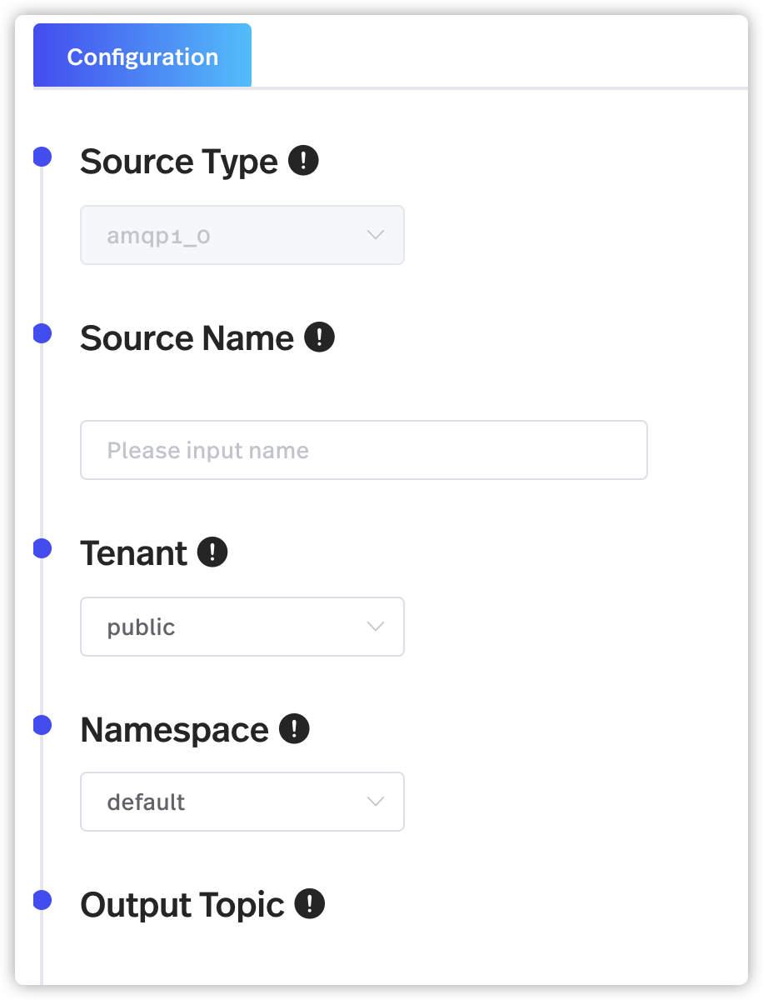
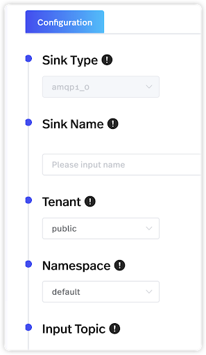
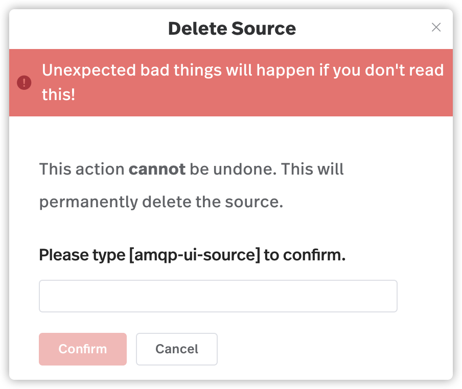
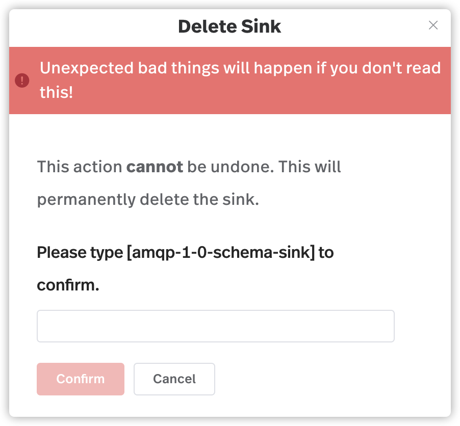

# 通过 StreamNative 控制台使用连接器

本文介绍了如何通过 StreamNative 控制台来使用连接器。

目前，StreamNative 控制台支持以下连接器： 

* AMQP1_0 [source](https://hub.streamnative.io/connectors/amqp-1-0-source/v2.7.1.1) 和 [sink](https://hub.streamnative.io/connectors/amqp-1-0-sink/v2.7.1.1) 连接器
* AWS SQS [source](https://hub.streamnative.io/connectors/sqs-source/2.7.0) 和 [sink](https://hub.streamnative.io/connectors/sqs-sink/2.7.0) 连接器
* Cloud Storage [sink](https://hub.streamnative.io/connectors/cloud-storage-sink/2.5.1) 连接器
* Kinesis [source](https://hub.streamnative.io/connectors/kinesis-source/2.5.1) 和 [sink](https://hub.streamnative.io/connectors/kinesis-sink/2.5.1) 连接器
* 数据生成器的 source 和 sink 连接器（仅用于内部测试）

>**注意**
>
> 目前，Cloud Storage sink 连接器仅可用于 AWS 平台。

# 创建连接器

本节介绍了如何创建 source 和 sink 连接器。

## 创建 source 连接器

按照如下步骤创建 source 连接器：

1. 从左侧导航窗格中，点击**连接器** > **Source**。

2. 点击想要创建的 source 连接器类型的图标，进入 source 连接器的配置页面。

   

3. 如下表所列，配置 source 连接器的相关选项。

<table>
  <tr>
   <td>
字段
   </td>
   <td>描述
   </td>
  </tr>
  <tr>
   <td>Source 类别
   </td>
   <td>（只读）Source 连接器的类型。
   </td>
  </tr>
  <tr>
   <td>Source 名
   </td>
   <td>为 source 连接器输入一个名称。它是一串字符，支持小写字符、数字字符和特殊字符连字符（-）。
   </td>
  </tr>
  <tr>
   <td>租户
   </td>
   <td>为 source 连接器选择租户。
   </td>
  </tr>
  <tr>
   <td>命名空间
   </td>
   <td>为 source 连接器选择命名空间。
   </td>
  </tr>
  <tr>
   <td>输出主题
   </td>
   <td>选择接收消息的 Pulsar 主题。
   </td>
  </tr>
  <tr>
   <td>副本
   </td>
   <td>设置运行 source 连接器的实例数量。
   </td>
  </tr>
  <tr>
   <td>启用自动扩缩
   </td>
   <td>启用或禁用自动扩缩。如果启用，则应该设置运行 source 连接器的最大实例数。最大实例数必须大于”副本“的值，并且等于或小于 10。
   </td>
  </tr>
  <tr>
   <td>Config
   </td>
   <td>（可选）配置 source 连接器。支持的 source 连接器的配置的详细描述，参阅 [StreamNative Hub](<a href="https://hub.streamnative.io/">https://hub.streamnative.io/</a>)。如果不对 source 连接器进行配置，则连接器将按照默认配置创建。
   </td>
  </tr>
</table>

4. 点击**创建**。

## 创建 sink 连接器

按照如下步骤创建 sink 连接器：

1. 从左侧导航窗格中，点击 **连接器** > **Sink**。

2. 点击想要新建的 sink 连接器类型的图标，进入 sink 连接器的配置页面。

   

3. 如下表所列，配置有关 sink 连接器的选项。

<table>
  <tr>
   <td>
字段
   </td>
   <td>描述
   </td>
  </tr>
  <tr>
   <td>Sink 类别
   </td>
   <td>（只读）Sink 连接器的类型。
   </td>
  </tr>
  <tr>
   <td>Sink 名
   </td>
   <td>输入 sink 连接器的名称。
   </td>
  </tr>
  <tr>
   <td>租户
   </td>
   <td>为 sink 连接器选择租户。
   </td>
  </tr>
  <tr>
   <td>命名空间
   </td>
   <td>为 sink 连接器选择命名空间。
   </td>
  </tr>
  <tr>
   <td>输入主题
   </td>
   <td>点击<strong>添加</strong>，添加更多输出消息的 Pulsar 主题。
   </td>
  </tr>
  <tr>
   <td>副本
   </td>
   <td>设置运行 sink 连接器的实例数量。
   </td>
  </tr>
  <tr>
   <td>启用自动扩缩
   </td>
   <td>启用或禁用自动扩缩。如果启用，则应该设置运行 sink 连接器的最大实例数。最大实例数必须大于”副本“的值，并且等于或小于 10。
   </td>
  </tr>
  <tr>
   <td>Config
   </td>
   <td>（可选）配置 sink 连接器。支持的 sink 连接器的配置的详细描述，参阅[StreamNative Hub](<a href="https://hub.streamnative.io/">https://hub.streamnative.io/</a>)。如果不对 sink 连接器进行配置，则连接器将按照默认配置创建。
   </td>
  </tr>
</table>

4. 点击**创建**。

# 更新连接器 

创建连接器后，可以对连接器的一些字段进行更新。本节介绍了如何对 source 和 sink 连接器进行更新。

## 更新 source 连接器

按照如下步骤更新 source 连接器：

1. 从左侧导航窗格中，点击 **连接器** > **Source**。

2. 点击目标 source 连接器，可以查看 source 连接器相关信息。

3. 更新如下有关 source 连接器的项目：

    * 租户：为 source 连接器配置目标租户。
    * 命名空间：为 source 连接器配置目标命名空间。
    * 输出主题：更新接收消息的 Pulsar 主题。
    * 副本：更新运行 source 连接器的实例数。
    * 自动扩缩：启用自动扩缩时，更新运行 source 连接器的最大实例数。
    * Config：更新 source 连接器的配置。
4. 点击**更新**。

## 更新 sink 连接器

按照如下步骤更新 sink 连接器：

1. 从左侧导航窗格中，点击 **连接器** > **Sink**。
2. 点击目标 sink 连接器，可以查看 sink 连接器相关信息。
3. 更新如下有关 sink 连接器的项目：
    * 租户：为 sink 连接器配置目标租户。
    * 命名空间：为 sink 连接器配置目标命名空间。
    * 输入主题：
        * 点击**添加**为 sink 连接器添加一个或多个 Pulsar 主题。
        * 点击**删除**为 sink 连接器删除一个或多个 Pulsar 主题。
    * 副本：更新运行 sink 连接器的实例数。
    * 自动扩缩：启用自动扩缩时，更新运行 sink 连接器的最大实例数。
    * Config：更新 sink 连接器的配置。
4. 点击**更新**。

# 克隆连接器

如果想要创建连接器，并且无需修改太多的配置，则可以克隆一个现有的连接器，然后根据需求更新配置。

## 克隆 source 连接器

按照如下步骤克隆 source 连接器：

1. 从左侧导航窗格中，点击 **连接器** > **Source**。
2. 点击目标 source 连接器。
3. 向下滚动页面，然后单击**克隆**。在显示的页面中，根据需求配置 source 连接器。

   

<table>
  <tr>
   <td>
字段
   </td>
   <td>描述
   </td>
  </tr>
  <tr>
   <td>Source 名
   </td>
   <td>输入 source 连接器的名称。它是一串字符，支持小写字符、数字字符和特殊字符连字符（-）。
   </td>
  </tr>
  <tr>
   <td>租户
   </td>
   <td>为 source 连接器选择租户。  
   </td>
  </tr>
  <tr>
   <td>命名空间
   </td>
   <td>为 source 连接器选择命名空间。
   </td>
  </tr>
  <tr>
   <td>输出主题
   </td>
   <td>选择接收消息的 Pulsar 主题。
   </td>
  </tr>
  <tr>
   <td>副本
   </td>
   <td>设置运行 source 连接器的实例数量。
   </td>
  </tr>
  <tr>
   <td>启用自动扩缩
   </td>
   <td>启用或禁用自动扩缩。如果启用，则应该设置运行 source 连接器的最大实例数。最大实例数必须大于”副本“的值，并且等于或小于 10。
   </td>
  </tr>
  <tr>
   <td>Config
   </td>
   <td>（可选）配置 source 连接器。支持的 source 连接器的配置的详细说明，参阅 [StreamNative Hub](<a href="https://hub.streamnative.io/">https://hub.streamnative.io/</a>)。如果不对 source 连接器进行配置，则将使用默认配置创建连接器。
   </td>
  </tr>
</table>

4. 点击**创建**。

## 克隆 sink 连接器

按照如下步骤克隆 sink 连接器：

1. 从左侧导航窗格中，点击 **连接器** > **Sink**。
2. 点击目标 sink 连接器。
3. 向下滚动页面，然后单击**克隆**。在显示的页面中，根据需求配置 sink 连接器。

   

<table>
  <tr>
   <td>字段
   </td>
   <td>描述
   </td>
  </tr>
  <tr>
   <td>Sink 名
   </td>
   <td>输入 sink 连接器的名称。
   </td>
  </tr>
  <tr>
   <td>租户
   </td>
   <td>为 sink 连接器选择租户。
   </td>
  </tr>
  <tr>
   <td>命名空间
   </td>
   <td>为 sink 连接器选择命名空间。
   </td>
  </tr>
  <tr>
   <td>输入主题
   </td>
   <td>
<ul>

<li>点击<strong>添加</strong>为 sink 连接器添加一个或多个 Pulsar 主题。

<li>点击<strong>删除</strong>删除一个或多个 sink 连接器的 Pulsar 主题。
</li>
</ul>
   </td>
  </tr>
  <tr>
   <td>副本
   </td>
   <td>设置运行 sink 连接器的实例量。
   </td>
  </tr>
  <tr>
   <td>启用自动扩缩 
   </td>
   <td>启用或禁用自动扩缩。如果启用，则应该设置运行 sink 连接器的最大实例数。最大实例数必须大于”副本“的值，并且等于或小于 10。
   </td>
  </tr>
  <tr>
   <td>Config
   </td>
   <td>（可选）配置 sink 连接器。支持的 sink 连接器的配置的详细描述，参阅 [StreamNative Hub](<a href="https://hub.streamnative.io/">https://hub.streamnative.io/</a>)。如果不对 sink 连接器进行配置，则将使用默认配置创建连接器。
   </td>
  </tr>
</table>

4. 点击**创建**。

# 删除连接器

本节介绍了如何删除 source 和 sink 连接器。

## 删除 source 连接器

按照如下步骤删除 source 连接器：

1. 从左侧导航窗格中，点击 **连接器** > **Source**。
2. 点击目标 source 连接器，然后向下滚动页面。
3. 点击**删除 Source**。
  
   

4. 输入 source 连接器名，点击**确认**。

## 删除 sink 连接器

按照如下步骤删除 sink 连接器：

1. 从左侧导航窗格中，点击 **连接器** > **Sink**。
2. 点击目标 sink 连接器，然后向下滚动页面。
3. 点击**删除 Sink**，出现对话框。

   

4. 输入 sink 连接器名，点击**确认**。
