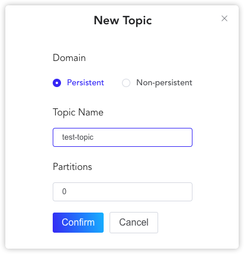
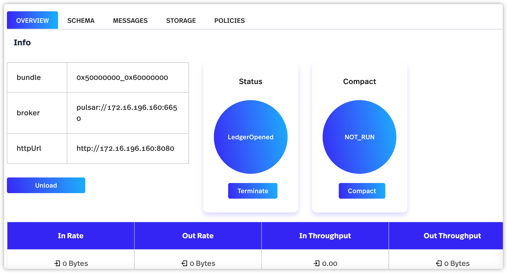
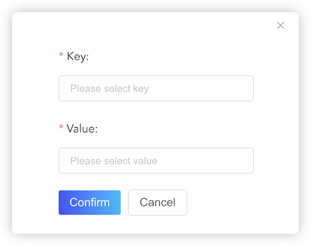
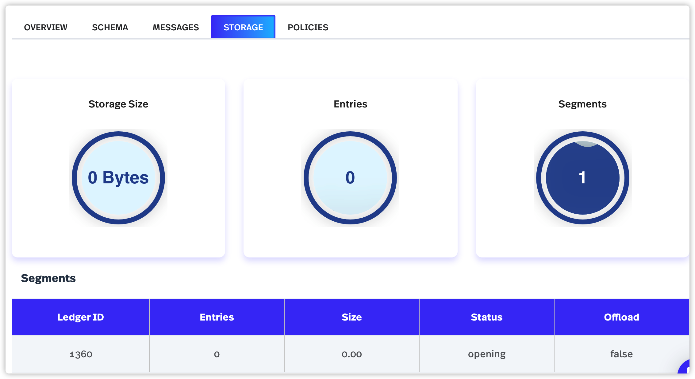
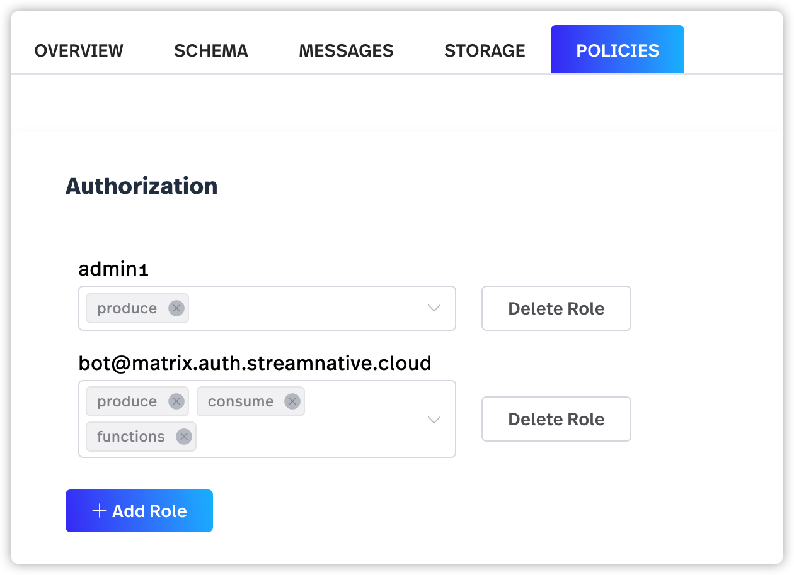
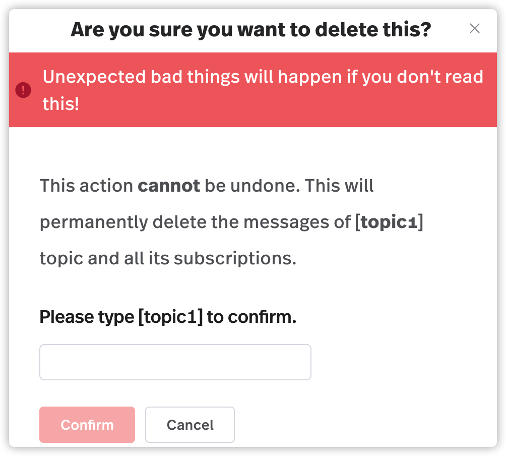

在 Pulsar 中，主题是有命名的通道，将消息从生产者传递给消费者。Pulsar 支持持久化和非持久化主题。默认情况下，如果不指定主题类型，就会创建一个持久化的主题。

本文介绍如何了使用 pulsarctl CLI （命令行工具）或 StreamNative 控制台为集群创建和管理主题。

# 使用 pulsarctl CLI 工具操作主题

本节介绍了如何使用 pulsarctl CLI（命令行工具）创建和管理主题。有关主题支持操作的完整列表，参见 [pulsarctl 命令参考](https://docs.streamnative.io/pulsarctl/v2.7.0.7/#-em-update-em--32)。

在使用 pulsarctl CLI（命令行工具）创建和管理主题之前，需要先创建[租户](/user-guides/admin/work-with-tenants.md#创建租户)和[命名空间](/user-guides/admin/work-with-namespaces.md#创建命名空间)。

## 创建主题

可以使用  `pulsarctl topics create TOPIC_NAME` 命令来创建主题。

* 如果要创建非分区主题，则需要将分区数设置为 `0`。

    如下示例显示了如何在 `example-tenant/example-ns` 命名空间中创建非分区主题。

    **输入**
    ```
    pulsarctl topics create example-tenant/example-ns/topic-test 0
    ```

    **输出**
    ```
    Create topic persistent://example-tenant/example-ns/topic-test with 0 partitions successfully
    ```

* 如果要创建分区主题，则需要将分区数设置为特定的数值。

    如下示例显示了如何在 `example-tenant/example-ns` 命名空间中创建具有 5 个分区的主题。

    **输入**
    ```
    pulsarctl topics create example-tenant/example-ns/test-topic 5
    ```
    
    **输出**
    ```
    Create topic persistent://example-tenant/example-ns/test-topic with 5 partitions successfully
    ```

## 获取主题状态

可以使用 `pulsarctl topics get TOPIC_NAME` 命令获得关于某个主题的信息。

* 如下示例显示了如何列出 `example-tenant/example-ns` 命名空间的所有可用主题。

    **输入**
    ```
    pulsarctl topics list example-tenant/example-ns/
    ```

    **输出**
    ```
    +--------------------------------------------------------------------------------+-----------------------+
    |                 TOPIC NAME                                                          | PARTITIONED ? |
    +--------------------------------------------------------------------------------+-----------------------+
    | persistent://example-tenant/example-ns/topic-test                  | N                         |
    | persistent://example-tenant/example-ns/test-topic                  | Y                         |
    | persistent://example-tenant/example-ns/test-topic-partition-0 | N                         |
    | persistent://example-tenant/example-ns/test-topic-partition-1 | N                         |
    | persistent://example-tenant/example-ns/test-topic-partition-2 | N                         |
    | persistent://example-tenant/example-ns/test-topic-partition-3 | N                         |
    | persistent://example-tenant/example-ns/test-topic-partition-4 | N                         |
    +--------------------------------------------------------------------------------+-----------------------+
    ```

* 如下示例显示了如何获取 `topic-test` 主题的详细信息。 

    **输入** 
    ```
    pulsarctl topics get topic-test
    ```
    **输出**
    ```shell
    {
    "partitions": 0
    }
    ```

## 删除主题

可以使用 `pulsarctl topics delete TOPIC_NAME` 命令删除分区主题。要删除未分区主题需要设置`--non-partitioned` 参数。

* 如下示例显示了如何删除 `test-topic` 分区主题。

    **输入**
    ```
    pulsarctl topics delete topic-test
    ```

    **输出**
    ```
    Delete topic persistent://example-tenant/example-ns/test-topic  successfully
    ```

* 如下示例显示了如何删除 `topic-test` 非分区主题。

    **输入**
    ```
    pulsarctl topics delete --non-partitioned topic-test
    ```
    
    **输出**
    ```
    Delete topic persistent://example-tenant/example-ns/topic-test  successfully
    ```

# 使用 StreamNative 控制台操作主题

可以使用 StreamNative 控制台来创建和管理主题。在使用 StreamNative 控制台创建和管理主题之前，需要先创建[租户](/user-guides/admin/work-with-tenants.md#创建租户)和[命名空间](/user-guides/admin/work-with-namespaces.md#创建命名空间)。

## 创建主题

按照如下步骤来新建主题：

1. 从左侧导航窗格中，点击**主题**。

2. 点击**添加主题**，出现对话框。

    

3. 按下表配置主题。

    <table>
    <tr>
    <td>
    项目
    </td>
    <td>描述
    </td>
    </tr>
    <tr>
    <td>域
    </td>
    <td>可以将主题配置成以下类型之一：
    <ul>

    <li>持久性主题：这类主题将被持久保存，消息存储在存储磁盘上。

    <li>非持久性主题：这类主题不会持久化到磁盘上，只存储在内存中。

    <p>
    默认情况下设为<em>持久性主题</em>。
    </li>
    </ul>
    </td>
    </tr>
    <tr>
    <td>主题名称
    </td>
    <td>输入主题的名称。主题名称为一串字符，支持小写字母（a-z）、数字字符（0-9）和特殊字符连字符（_）。
    </td>
    </tr>
    <tr>
    <td>分区
    </td>
    <td>为分区主题配置分区数。如果此值设置为 0，则表示是一个未分区的主题。一个分区主题最多可设 16 个分区。
    </td>
    </tr>
    </table>

4. 点击**确定**。

## 管理主题

可以查看目标主题的详细信息，配置主题的订阅名称，以及卸载、终止和压缩主题。

按照如下步骤对主题进行基本操作：

1. 从左侧导航窗格中，点击**主题**。

2. 点击主题名称链接可显示该主题的详细信息。

3. （仅适用于分区主题）点击特定主题上具体分区的链接。

4. 选择**概况**选项卡。可以执行以下操作：

    

   * 卸载主题：点击**卸载**来卸载主题。
   * 终止主题：点击**终止**来终止主题。
   * 压缩主题：点击**压缩**来压缩主题。
   * 查看关于该主题的详细信息。

## 查看主题详细信息

按照如下步骤，查看关于主题的详细信息：

1. 从左侧导航窗格中，点击**主题**。

2. 点击主题名称链接，可以显示该主题的详细信息。

3. （仅适用于分区主题）点击特定主题上具体分区的链接。

4. 选择**概况**选项卡，查看主题相关的详细信息。


    <table>
    <tr>
    <td>项目
    </td>
    <td>描述
    </td>
    </tr>
    <tr>
    <td>信息
    </td>
    <td>查看关于主题的基本信息。
    <ul>
    
    <li>输入速率：主题的输入速率。
    
    <li>输出速率：主题的输出速率。 
    
    <li>输入吞吐量：主题的输入吞吐量。 
    
    <li>输出吞吐量：主题的输出吞吐量。
    </li>
    </ul>
    </td>
    </tr>
    <tr>
    <td>生产者
    </td>
    <td>查看关于该生产者的信息。
    <ul>
    
    <li>生产者 ID：主题的生产者 ID。
    
    <li>生产者名称：主题的生产者名称。
    
    <li>输出吞吐量：主题的输出吞吐量。
    
    <li>输入速率：主题的输入速率。
    
    <li>平均消息大小：主题的平均消息大小。
    
    <li>地址：消息的地址。
    
    <li>创建时间：创建生产者的时间。
    </li>
    </ul>
    </td>
    </tr>
    <tr>
    <td>订阅
    </td>
    <td>查看订阅相关的信息。
    <ul>
    
    <li>订阅名称：主题的订阅名称。点击<strong>添加订阅</strong>，为目标主题创建新的订阅名称。
    
    <li>类型：主题的订阅类型。目前 StreamNative 控制台不支持为主题配置订阅类型。可以使用 pulsarctl CLI（命令行工具）配置订阅类型。
    
    <li>输入速率：主题的输入速率。
    
    <li>输出速率：主题的输出速率。
    
    <li>过期消息：主题的过期消息。
    
    <li>Backlog：配置订阅的 backlog。
    <ul>
    
    <li>SKIP：为订阅跳过一些消息。
    
    <li>过期：为订阅将到期时间（以秒为单位）前的旧消息进行过期处理。
    
    <li>清除：为订阅清除 backlog。
    
    <li>RESET BY ID：重置基于订阅的消息 ID。
    
    <li>RESET BY TIME：订阅创建时，重置时间。 
    
    <li>PEEK：查看订阅的一些消息。
    
    <li>取消订阅：删除订阅。
    </li> 
    </ul>
    </li> 
    </ul>
    </td>
    </tr>
    <tr>
    <td>分区
    </td>
    <td>查看分区主题的分区信息。
    <ul>
    
    <li>分区：分区ID。
    
    <li>生产者：该分区的生产者数量。
    
    <li>订阅：该分区的订阅数。
    
    <li>输入速率：该分区的输入速率。
    
    <li>输出速率：该分区的输出速率。
    
    <li>输入吞吐量：该分区的输入吞吐量。
    
    <li>输出吞吐量：该分区的输出吞吐量。
    
    <li>存储大小：分区的存储大小。
    </li>
    </ul>
    </td>
    </tr>
    </table>

## 消息 schema

启用 schema 后，Pulsar 在解析数据时将字节作为输入并发送字节作为输出。

> **注意**
> 
> 目前，StreamNative 控制台仅支持 Avro 类型和 JSON 类的 schema。

按照如下步骤为主题配置 schema：

1. 从左侧导航窗格中，点击**主题**。

2. 点击主题名称链接。

3. （仅适用于分区主题）点击分区主题的分区链接。

4. 选择 **SCHEMA**  选项卡。

5. 点击**创建 Schema**，切换到为目标主题配置 schema 的页面。

   * 从 **Schema 类型**下拉列表中选择一种 schema 类型。 
   * 在 **Schema 定义** 区域定义 schema。此外，可以点击**格式代码**格式化代码。
   * 在**属性**区域，点击加号（+），出现对话框，可以为 schema 配置键和值。然后点击**确定**。 

        

6. 点击**创建 Schema**。

## 查看主题存储

按照如下步骤，查看主题的存储：

1. 从左侧导航窗格中，点击**主题**。

2. 点击主题名称链接。

3. （仅适用于分区主题）点击分区主题的分区链接。

4. 选择**存储**选项卡，查看主题的存储信息。

   

    <table>
    <tr>
    <td>项目
    </td>
    <td>描述
    </td>
    </tr>
    <tr>
    <td>存储大小
    </td>
    <td>表示存储的大小。
    </td>
    </tr>
    <tr>
    <td>Entry
    </td>
    <td>Entry 的数量。
    </td>
    </tr>
    <tr>
    <td>Segment
    </td>
    <td>Segment 的数量。
    </td>
    </tr>
    <tr>
    <td>Segment
    </td>
    <td>查看关于 ledger 的信息。
    <ul>

    <li>Ledger ID：ledger 的 ID。
   
    <li>Entry：属于 ledger 的 entry 的总数。
   
    <li>Ledger 大小：写入 ledge 消息的大小（单位为字节）。
   
    <li>状态：用于写消息的 ledger 的状态。如果设置为 `Opening`，则 ledger 将打开以保存已发布的消息。
   
    <li>卸载：ledge 是否可以被卸载。
    </li>
    </ul>
    </td>
    </tr>
    <tr>
    <td>游标
    </td>
    <td>查看关于游标的信息。
   
    <ul>
   
    <li>游标：游标的 ID。
   
    <li>标记删除位置：在 `markDeletePosition` 之前的所有消息都被订阅者确认。
   
    <li>读取位置：订阅者读取消息的最新位置。
   
    <li>等待读取操作：当订阅已读取发布到主题的最新消息，并等待新消息发布时，被设置为 `True`。
   
    <li>挂起读取操作：正在进行的对 BookKeeper 的读取请求的数量。
   
    <li>未签收的 Entry：未确认的 entry。
    </li>
    </ul>
    </td>
    </tr>
    </table>

## 配置主题策略

可以为主题配置策略。按照如下步骤，配置主题策略：

1. 从左侧导航窗格中，点击**主题**。

2. 点击主题名称链接。

3. （仅适用于分区主题）点击分区主题的分区链接。

4. 选择**策略**选项卡，配置主题的授权策略。

   

    <table>
    <tr>
    <td>项目
    </td>
    <td>描述
    </td>
    </tr>
    <tr>
    <td>授权
    </td>
    <td>授予/撤销其他客户端角色的权限。如果已授予或撤销对某个命名空间的权限，则该命名空间中的所有主题都将被授予或撤销相同的权限。
    <ul>


    <li>consume：授予/撤销消费操作。
    
    <li>produce：授予/撤销生产操作。
    
    <li>functions：授予/撤销 Pulsar Function 操作。
    </li>
    </ul>
    </td>
    </tr>
    </table>

5. （可选）点击**添加角色**为主题添加更多权限。

## 删除主题

如果不希望再订阅某个主题，可以移除该主题。按照如下步骤删除主题：

1. 从左侧导航窗格中，点击**主题**。

2. 点击主题名称链接。

3. （仅适用于分区主题）点击分区主题的分区链接。

4. 选择**策略**选项卡，点击**删除主题**。出现对话框，询问*“删除主题”*  。

   

5. 点击**确定**。