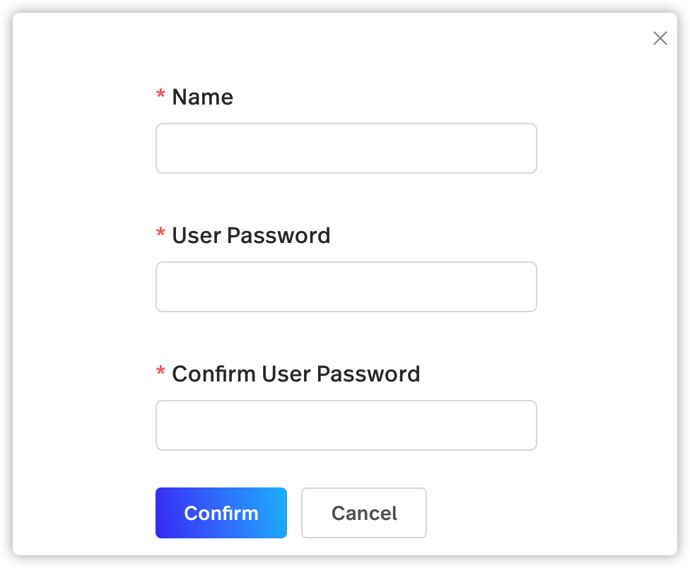
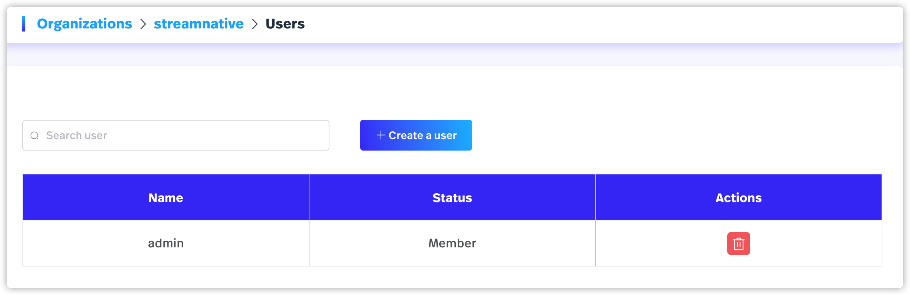
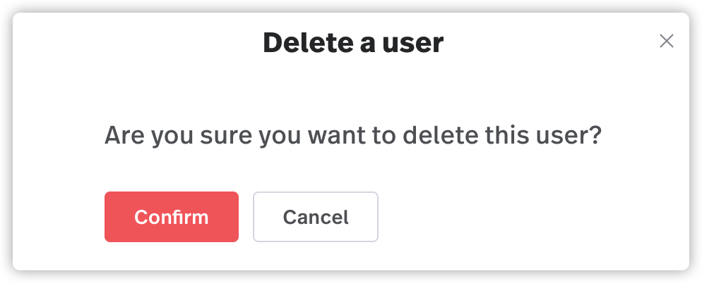

StreamNative Platform 支持为组织创建一个或多个用户。获得授权后，这些用户可以对 Pulsar 租户、命名空间、主题等进行操作。本文介绍了如何使用 StreamNative 控制台创建用户、查看用户状态和删除用户。

# 创建用户

按照如下步骤创建用户：

1. 在 StreamNative 控制台的右上角，从帐户下拉列表中选择**用户**。

2. 点击**创建用户**，弹出如下对话框。

   

3. 按如下表格配置用户。

    <table>
    <tr>
    <td>
    字段
    </td>
    <td>描述
    </td>
    </tr>
    <tr>
    <td>名称
    </td>
    <td>输入用户名。用户名为一串字符，支持小写字母（a-z）、数字字符（0-9）和特殊字符连字符（_）。
    </td>
    </tr>
    <tr>
    <td>用户密码
    </td>
    <td>为用户配置密码。
    </td>
    </tr>
    <tr>
    <td>确认用户密码
    </td>
    <td>确认用户的密码。
    </td>
    </tr>
    </table>

4. 点击**确定**。

# 查看用户状态

在 StreamNative 控制台右上角，从帐户下拉列表中选择**用户**后，可以查看组织可用的用户，包括用户的名称和状态。

   

# 删除用户

> **注意**
> 
> 作为管理员，可以删除用户。

按照如下步骤删除用户：

1. 在 StreamNative 控制台的右上角，从帐户下拉列表中选择**用户**。

2. 点击**操作**列中的**删除**图标。

3. 出现对话框，询问*”确认删除该用户？“* 

   

4. 点击**确定**。